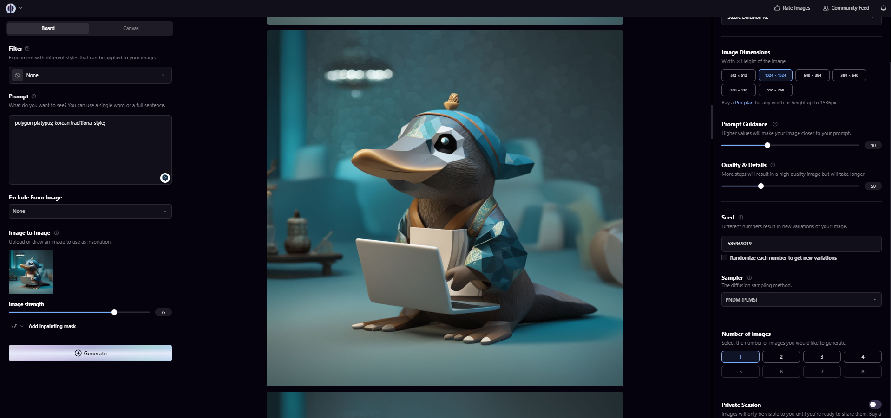

# Poly-platypus-ko
# KO-Platypus (Ko-Platy🥮)

**Korean-Open-platypus를 활용하여 Polyglot-ko를 fine-tuning한 Korean-Platypus model**  
  
**Poly-platypus-ko-12.8b🥮:** [](https://huggingface.co/MarkrAI/kyujin-Poly-platypus-ko-12.8b)   
**KOpen-Platypus🥮:** [](https://huggingface.co/datasets/kyujinpy/KOpen-platypus)   
- 본 연구는 (주)마커와 (주)미디어그룹사람과숲의 오픈소스 LLM 연구 컨소시엄에서 진행되었습니다.

# KO-platypus2
[KO-platypus2](https://github.com/Marker-Inc-Korea/KO-Platypus)  

# Performance
When I evaluated Ko-Platy, I used this [repo](https://github.com/Beomi/ko-lm-evaluation-harness).  
And, implement below code.
```
# In colab,
!python main.py \
    --model gpt2 \ 
    --model_args pretrained=..your_model_name.. \
    --tasks kobest_hellaswag,kobest_copa,kobest_boolq,kobest_sentineg \
    --device cuda:0 \
    --num_fewshot 0 # 5, 10, 25, ...
```
  
### COPA (F1)
| Model | 0-shot | 5-shot | 10-shot | 50-shot |
| --- | --- | --- | --- | --- |
| [Polyglot-ko-5.8b](https://huggingface.co/EleutherAI/polyglot-ko-5.8b) | 0.7745 | 0.7676 | 0.7775 | 0.7887 |
| [Polyglot-ko-12.8b](https://huggingface.co/EleutherAI/polyglot-ko-12.8b) | 0.7937 | 0.8108 | 0.8037 | 0.8369 |
| [Llama-2-Ko-7b 20B](https://huggingface.co/beomi/llama-2-ko-7b) | 0.7388 | 0.7626 | 0.7808 | 0.7979 |
| [Llama-2-Ko-7b 40B](https://huggingface.co/beomi/llama-2-ko-7b) | 0.7436 | 0.7927 | 0.8037 | 0.8259 | 
| [KO-platypus2-7B-EX](https://huggingface.co/kyujinpy/KO-Platypus2-7B-ex) | 0.7509 | 0.7899 | 0.8029 | 0.8290 |  
| [KoT-platypus2-7B](https://huggingface.co/kyujinpy/KoT-platypus2-7B) | 0.7517 | 0.7868 | 0.8009 | 0.8239 |   
| **Poly-platypus-ko-12.8b(ours)** | 0.7876 | 0.8099 | 0.8008 | 0.8239 |   
   
### HellaSwag (F1)
| Model | 0-shot | 5-shot | 10-shot | 50-shot |
| --- | --- | --- | --- | --- |
| [Polyglot-ko-5.8b](https://huggingface.co/EleutherAI/polyglot-ko-5.8b) | 0.5976 | 0.5998 | 0.5979 | 0.6208 |
| [Polyglot-ko-12.8b](https://huggingface.co/EleutherAI/polyglot-ko-12.8b) | 0.5954 | 0.6306 | 0.6098 | 0.6118 |
| [Llama-2-Ko-7b 20B](https://huggingface.co/beomi/llama-2-ko-7b) | 0.4518 | 0.4668 | 0.4726 | 0.4828 |
| [Llama-2-Ko-7b 40B](https://huggingface.co/beomi/llama-2-ko-7b) | 0.4562 | 0.4657 | 0.4698 | 0.4774 |
| [KO-platypus2-7B-EX](https://huggingface.co/kyujinpy/KO-Platypus2-7B-ex) | 0.4571 | 0.4461 | 0.4371 | 0.4525 |  
| [KoT-platypus2-7B](https://huggingface.co/kyujinpy/KoT-platypus2-7B) | 0.4432 | 0.4382 | 0.4550 | 0.4534 | 
| **Poly-platypus-ko-12.8b(ours)** | 0.4838 | 0.4858 | 0.5005 | 0.5062 |   
  
### BoolQ (F1)
| Model | 0-shot | 5-shot | 10-shot | 50-shot |
| --- | --- | --- | --- | --- |
| [Polyglot-ko-5.8b](https://huggingface.co/EleutherAI/polyglot-ko-5.8b) | 0.4356 | 0.5698 | 0.5187 | 0.5236 |
| [Polyglot-ko-12.8b](https://huggingface.co/EleutherAI/polyglot-ko-12.8b) | 0.4818 | 0.6041 | 0.6289 | 0.6448 |
| [Llama-2-Ko-7b 20B](https://huggingface.co/beomi/llama-2-ko-7b) | 0.3607 | 0.6797 | 0.6801 | 0.6622 |
| [Llama-2-Ko-7b 40B](https://huggingface.co/beomi/llama-2-ko-7b) | 0.5786 | 0.6977 | 0.7084 | 0.7144 |
| [KO-platypus2-7B-EX](https://huggingface.co/kyujinpy/KO-Platypus2-7B-ex) | 0.6028 | 0.6979 | 0.7016 | 0.6988 |  
| [KoT-platypus2-7B](https://huggingface.co/kyujinpy/KoT-platypus2-7B) | 0.6142 | 0.6757 | 0.6839 | 0.6878 | 
| **Poly-platypus-ko-12.8b(ours)** | 0.4888 | 0.6520 | 0.6568 | 0.6835 |   
  
### SentiNeg (F1)
| Model | 0-shot | 5-shot | 10-shot | 50-shot |
| --- | --- | --- | --- | --- |
| [Polyglot-ko-5.8b](https://huggingface.co/EleutherAI/polyglot-ko-5.8b) | 0.3394 | 0.8841 | 0.8808 | 0.9521 |
| [Polyglot-ko-12.8b](https://huggingface.co/EleutherAI/polyglot-ko-12.8b) | 0.9117 | 0.9015 | 0.9345 | 0.9723 |
| [Llama-2-Ko-7b 20B](https://huggingface.co/beomi/llama-2-ko-7b) | 0.4855 | 0.8295 | 0.8711 | 0.8513 |
| [Llama-2-Ko-7b 40B](https://huggingface.co/beomi/llama-2-ko-7b) | 0.4594 | 0.7611 | 0.7276 | 0.9370 |
| [KO-platypus2-7B-EX](https://huggingface.co/kyujinpy/KO-Platypus2-7B-ex) | 0.5821 | 0.7653 | 0.7991 | 0.8643 |  
| [KoT-platypus2-7B](https://huggingface.co/kyujinpy/KoT-platypus2-7B) | 0.6127 | 0.7199 | 0.7531 | 0.8381 | 
| **Poly-platypus-ko-12.8b(ours)** | 0.8490 | 0.9597 | 0.9723 | 0.9847 |   
   
# References
[Kopen-Platypus🥮](https://huggingface.co/datasets/kyujinpy/KOpen-platypus)   
[MarkrAI/kyujin-Poly-platypus-ko-12.8b🥮](https://huggingface.co/MarkrAI/kyujin-Poly-platypus-ko-12.8b)  
[Platypus](https://github.com/arielnlee/Platypus)  
[Polyglot-ko-12.8b](https://huggingface.co/EleutherAI/polyglot-ko-12.8b)  
[ko-lm-evaluation-harness](https://github.com/Beomi/ko-lm-evaluation-harness)   

## Additional info about image
I made the image, inspired by [Platypus-LLM](https://github.com/arielnlee/Platypus).  
I used [Playground AI](https://playgroundai.com/), then applying prompt engineering. (For example, img2img, guidance etc...)  

  
When I made `Poly-platypus` image, I use prompt like above image.
